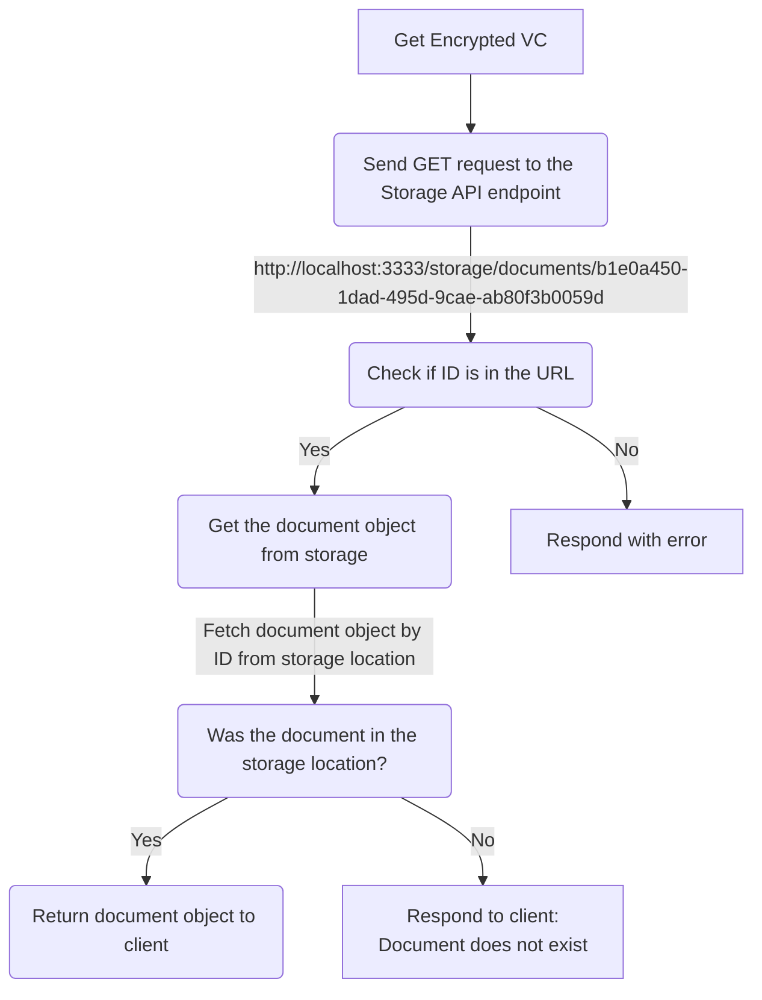

# Digital Verification Platform API

## Local development

#### Install the Dependencies

Navigate to the projects root directory and run the following command:

```
yarn install
```

#### Start the API

```
nx serve api
```

### Testing

#### Unit Tests

```
nx test api
```

#### Intergration Tests

```
nx serve api
nx intergration-tests api
```

## Services

### Storage API

This service exists to encrypt and store VCs that will later be accessed via QR codes, hyperlinks or directly via the API.

### Examples

#### Retrieving an uploaded document

```sh
curl --request GET \
  --url http://localhost:3333/storage/documents/95f6287d-11f7-42e5-8cc9-aefa25e754df
```



Will return

```json
{
  "document": {
    "cipherText": "HSKcfell3ocggQDfvg4CRHNptlfleWW3DEcdBbouFoS5Sp0STZmU2ddmchLcinsxYBkN+VFrFNhC3ws1vB6HEWq/mmz+7Vl0HRiBnC8NP4iZFEdbDelCuyfEoRLVenFXcQu2LnBB63aqicvNhzOs1p/dJQnmkr5zxR3vW0MgH+Xi8/NY+lOUu0+TTDs8S4AkhO3BsX1TnS8eWpjImDUxNDTA7tDiyx0m2Ns+EbqJY1q/wi5Wq1vqezpOLaBiAn4TJ4zYARU1BeiCbBGSaCKPtLZPhFYd9EeCTghqdgVqyL8ZuVONYELgvUATvtqJiOqTxkAVm2H9EoKzmP9hzwCW4r3JOl/glaST+IdXfq/aSxqUVbobLH4q7Ho7gNTM5wnvjmhpfo+K6ycsfTyHLvBGQqnITlH0+RnXsSTimxdmEPShG0ER8ul+5d8e68oozZntB6bkM3TxoZJ8idh2",
    "iv": "LKwFbAzol64l0OyN",
    "tag": "EOH28x8yC2pJDFCX/wVhqg==",
    "type": "OPEN-ATTESTATION-TYPE-1"
  }
}
```
